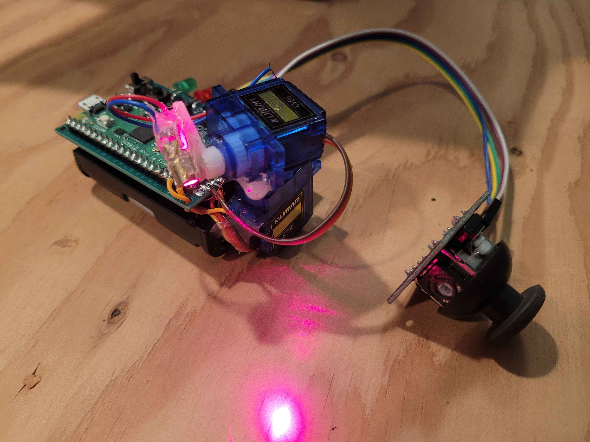

---

# Laser Tracer
Controllable laser pointer with recording and playback compatibility

## Build
Need cmake and the r-pi pico sdk setup with the path env vars set

Start in the project root: 
```
mkdir build
cd build 
cmake ..
ninja
```

## Upload
Use [picotool](https://github.com/raspberrypi/picotool.git)

Press the boot button, plug in, and type the following: 

```
picotool load ./build/lzr_cat.uf2
picotool reboot
```
